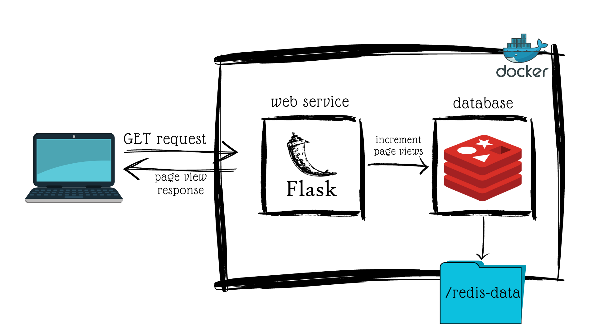
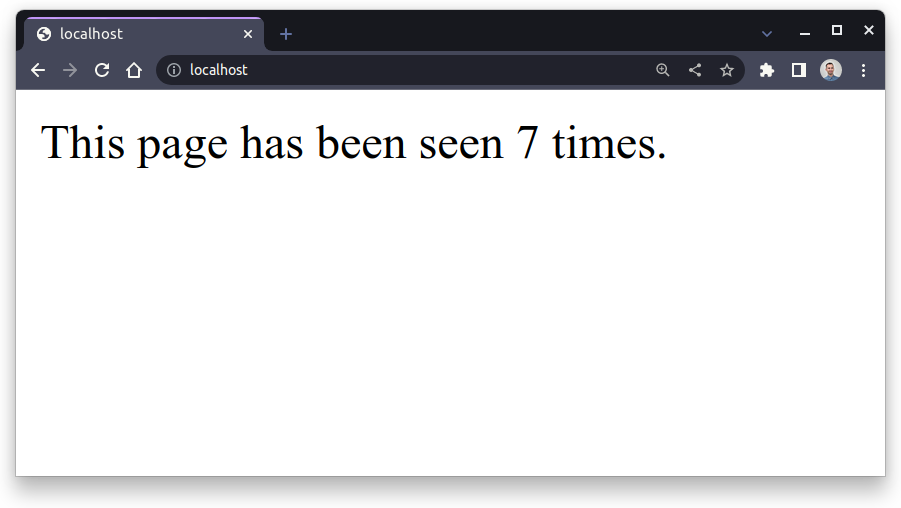

# Robust Continuous Integration with Docker

> **NOTE**
>
> This project follows Real Python's [Build Robust Continuous Integration with Docker and Friends][dockerizing-flask-ci] tutorial.

Docker containers help facilitate the _continuous integration_ (CI) process by providing a consistent environment where you can test and ship code on each commit.

This tutorial looks at how to use Docker to create a robust CI pipeline for a Flask web app. The steps followed in this tutorial cover developing and testing an application locally, containerizing it, orchestrating containers using _Docker Compose_, and defining a CI pipeline using _GitHub Actions_.

The resources used in this tutorial are:

- Redis server
- Flask web app
- Docker/Docker Compose
- Github Actions

> **NOTE**
>
> It's recommended to have some experience with the following concepts:
>
> - [Python web development][web-development]
> - [test automation][test-automation]
> - [Redis with Python][python-redis]
> - [version control with Github][github]

You can download a sample web application [here][flask-app-resources].

## Architecture Overview

By the end of this tutorial, you'll have designed a Flask web application for tracking page views stored persistently in a Redis data store. This will be a multi-container application orchestrated using Docker Compose. You'll be able to build and test locally, as well as in the cloud, opening up the pathway to continuous integration.

The architecture for this project is detailed below:



This application consists of two Docker containers:

- The first container will run a Flask app which responds to HTTP requests and updating the number of page views

- The second container will run a Redis instance for storing the page view data persistently in a local volume on the host machine

The great thing is Docker is all that's required to run this application! We'll set this up in the next section.

## Set Up Docker

Docker enables the ability to run applications anywhere in consistent and reproducible environments with little or no configuration. It can package application code and dependencies into a single artifact called a _container_. We'll use Docker to simulate a virtual production environment on your local machine during development and on a continuous integration server.

There are 2 methods to install Docker:

1. [Docker Engine][docker-engine]
2. [Docker Desktop][docker-desktop]

**Docker Engine** provides an extra level of control but requires comfortability with the command line. On the other hand, **Docker Desktop** provides an intuitive GUI for managing containers and images. Docker Desktop still comes with a command line interface (CLI) for more advanced operations.

> **NOTE**
>
> Out of the box, the desktop application comes with Docker Compose, which we'll use for orchestrating containers for continuous integration.

While it's possible to have both Docker Engine and Docker Desktop installed, you should generally avoid using them together to minimize the risk of any potential interference between their virtual networks or port bindings.

To verify you have Docker, or have successfully installed it on your system, open a terminal window and run the following command:

```shell
docker --version
Docker version 24.0.2, build cb74dfc
```

There should be a version along with the build number. If you don't see this, then you'll need to install Docker.

In general, before using Docker to assist in continuous integration, you'll need to create a rudimentary application, web or otherwise.

## Develop a Flask App &mdash; Page View Tracker

The Flask app in this tutorial will keep track of the total number of page views and display that number to the user with each request:



The current state of the application will be saved in a Redis data store, which is commonly used for caching and other types of data persistence. In this way, stopping the web server won't reset the view count. Redis can be considered a type of database.

> See the [resources link][flask-app-resources] if you're not interested in building this application from scratch. Either way, it'll be useful to cross reference in case you get stuck.

### Prepare the Environment

As with every Python project, it's best practice to create a virtual environment to isolate the dependencies. This will ensure that the dependencies for this project don't interfere with other projects on your system and help to maintain the smallest possible container image for your app.

In the terminal run the following commands:

```shell
mkdir page-tracker; cd page-tracker

python3.11 -m venv tracker-app-env
```

- The first line creates a new directory for our app and changes the working directory to it.

- The second line creates a virtual environment called `tracker-app-env` using Python 3.11 and the `venv` module (indicated by the `-m` flag). You can replace `python3.11` with `python3` (which uses the default Python version installed on your system) or whatever version of Python you prefer to use for this environment.

To activate the virtual environment, run the following command:

```shell
source tracker-app-env/bin/activate

(tracker-app-env) $ pip install --upgrade pip
```

- After activating the virtual environment, you should see the name of the environment in parentheses before the prompt.

- You should upgrade to the latest version of `pip` to avoid any potential issues with dependency resolution when installing Python packages.

In this tutorial, you'll use the modern way of specifying dependencies and metadata through a [`pyproject.toml`][pyproject-toml] configuration file and [setuptools][setuptools] as the [build backend][build-backend]. Additionally, you'll follow the [`src` layout][src-layout] by placing your app's source code in a separate `src/` subdirectory to better organize the files in your project. This makes it straightforward to package your code without the automated tests we'll add later.

To begin, create the following file tree:

```shell
page-tracker
├── pyproject.toml
├── requirements.txt
├── tracker-app-env
└── src
    └── page_tracker
        ├── __init__.py
        └── app.py
```

Based on the project structure, we'll only have one Python module, `app`, defined in a package called `page_tracker`, sitting inside the `src` directory. The `requirements.txt` file will specify dependencies for the project in order to achieve [repeatable installs][repeatable-installs].

> **NOTE**
>
> The original tutorial uses a `constraints.txt` file to manage package dependencies and versions. In this project, we use `requirements.txt` as it is simpler and we utilize the `pip-chill` package to only list the minimum required packages for app funcitonality.

Since this project will depend on Flask and Redis, we can declare that in the `pyproject.toml` file:

```toml
# pyproject.toml

[build-system]
requires = ["setuptools>=67.0.0", "wheel"]
build-backend = "setuptools.build_meta"

[project]
name = "page-tracker"
version = "1.0.0"
dependencies = [
    "Flask",
    "redis",
]
```

You typically don't specify dependency versions here. Instead, you would list them in a requirements or a constraints file. The first one tells `pip` what packages to install, the latter enforces specific versions of transitive dependencies.

Before coding the web app, we need to prepare a local Redis server to connect to over a network.

### Run a Redis Server Through Docker

[dockerizing-flask-ci]: https://realpython.com/docker-continuous-integration/

[web-development]: https://realpython.com/learning-paths/become-python-web-developer/
[test-automation]: https://realpython.com/learning-paths/test-your-python-apps/
[python-redis]: https://realpython.com/python-redis/
[github]: https://realpython.com/python-git-github-intro/

[flask-app-resources]: https://realpython.com/bonus/docker-continuous-integration-code/

[docker-engine]: https://docs.docker.com/engine/
[docker-desktop]: https://docs.docker.com/desktop/

[pyproject-toml]: https://realpython.com/courses/packaging-with-pyproject-toml/
[setuptools]: https://setuptools.pypa.io/en/latest/
[build-backend]: https://peps.python.org/pep-0517/
[src-layout]: https://packaging.python.org/en/latest/discussions/src-layout-vs-flat-layout/

[repeatable-installs]: https://pip.pypa.io/en/stable/topics/repeatable-installs/
